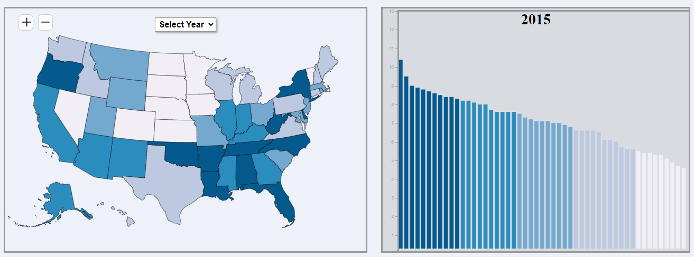

# unit-3 (Activities and Lab 2)
### Lab 2: Mental Distress - 65 and older (2015-2021)

This application shows the percentage of people in the United States that are age 65 and over that have been diagnosed with some type of mental distress related to aging.

